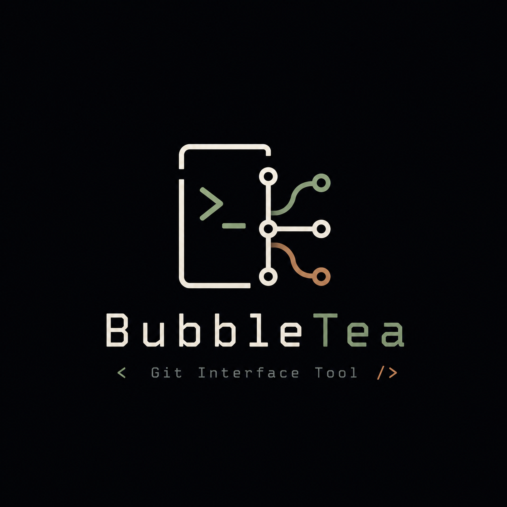

# bgit


A small git TUI. Write your logic in C++ (`src/main.cpp`), and a Go Bubble Tea TUI
(`tui.go`) renders it as a clean, professional interface.

```
  BGIT v1.0.0  awaiting input · ./bgit · goldstac/liproductions
──────────────────────────────────────────────────────────────
▸ [1] Add,Commit,Push
  [2] Add,Custom Commit Message,Push
Enter Your Choice: █
─── output────────────────────────────────────────────────────
  Welcome To BGIT
  Option's
```

## Quick start

```sh
g++ -o bgit src/main.cpp
go build -o bgit-tui tui.go
./bgit-tui
```

The TUI spawns your compiled C++ binary and turns its output into menus, input fields,
and streaming output. Edit C++ only — no Go changes needed.

## Install from AUR

```sh
yay -S bgit
bgit
```

After installing, `bgit` opens the TUI (the C++ logic runs as `bgit-core`). Also
available from your desktop's app menu.

## Developer docs

See [DEV.md](DEV.md) for the full developer docs: the C++ output conventions (`[N]`
menu items, `-->` prompts, `BGIT_VERSION`, `std::cerr` errors), key controls, how the
renderer works, and example code.

## Attribution

See [AI.md](AI.md) — the TUI was coded by AI, the core C++ logic by goldstac.